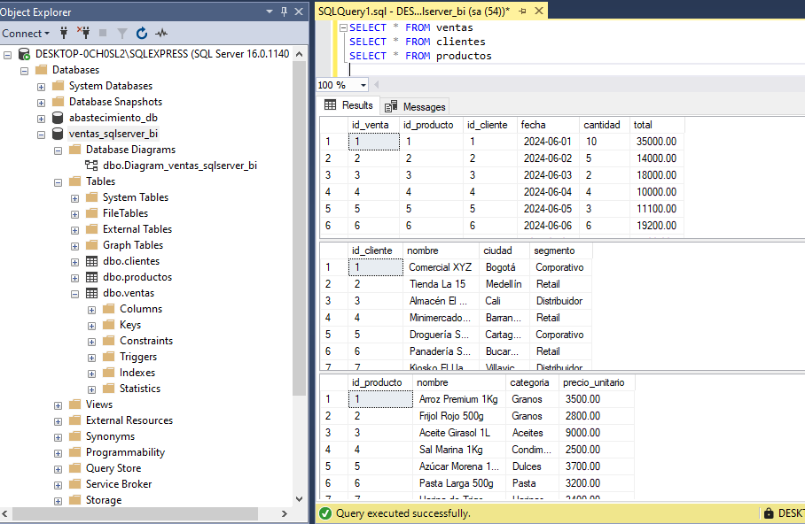
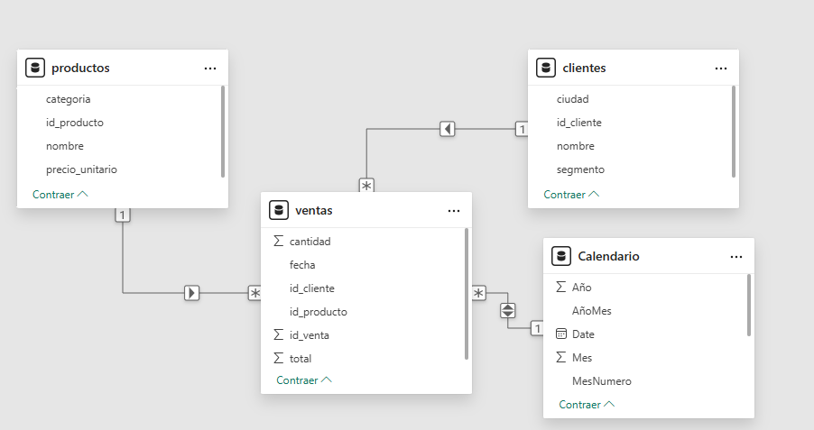
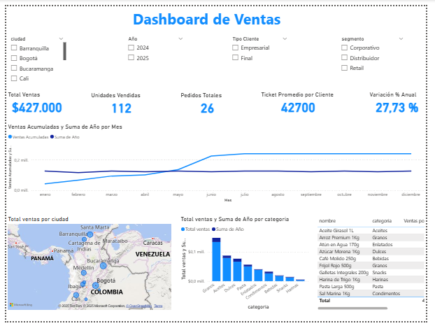
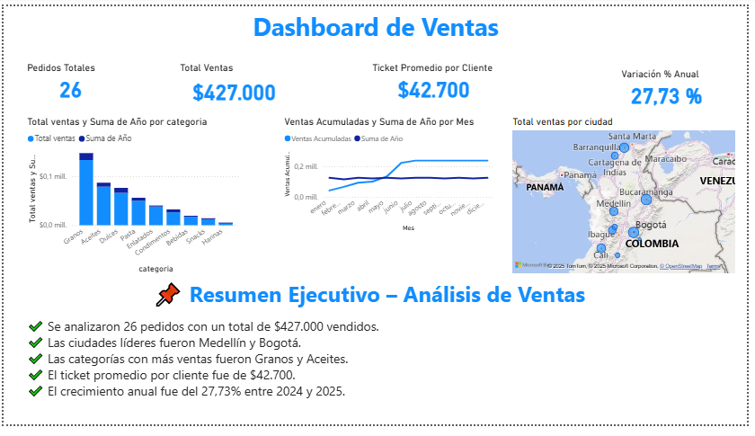

# 📈 Dashboard de Ventas – Power BI + SQL Server

📘 **Proyecto educativo centrado exclusivamente en Power BI.**

Incluye:  
✔️ Creación de medidas DAX  
✔️ Columnas calculadas útiles  
✔️ Segmentadores y visualizaciones KPI  
✔️ Mapa, gráfico de líneas, barras y storytelling  
✔️ Tips y recomendaciones para aplicar buenas prácticas en proyectos reales

Este proyecto muestra un análisis profesional de ventas utilizando **Power BI Desktop conectado directamente a SQL Server**.  
Fue construido paso a paso como parte de una práctica intensiva de visualización y análisis de datos reales.

---

## 🔗 Conexión a SQL Server

- **Servidor:** `DESKTOP-0CHOSL2\SQLEXPRESS`
- **Base de datos:** `ventas_sqlserver_bi`
- **Tablas utilizadas:**
  - `ventas` → tabla de hechos
  - `clientes` → dimensión
  - `productos` → dimensión

---

## 🧩 Modelo Estrella

Relaciones creadas:
- `ventas[id_cliente]` → `clientes[id_cliente]`
- `ventas[id_producto]` → `productos[id_producto]`
- `ventas[fecha]` → `Calendario[Date]`

---

## 📅 Tabla Calendario

Se creó una tabla calendario personalizada para permitir análisis por año, mes, trimestre, día de la semana, etc.

```DAX
Calendario = 
ADDCOLUMNS(
  CALENDAR(DATE(2024,1,1), DATE(2025,12,31)),
  "Año", YEAR([Date]),
  "Mes", MONTH([Date]),
  "NombreMes", FORMAT([Date], "MMMM"),
  "MesNumero", FORMAT([Date], "MM"),
  "AñoMes", FORMAT([Date], "YYYY-MM"),
  "NombreDia", FORMAT([Date], "dddd"),
  "NumeroDiaSemana", WEEKDAY([Date], 2),
  "Trimestre", "Q" & FORMAT([Date], "Q")
)
```

# 🧮 Medidas DAX Creadas
## 🔹 Ventas y unidades
```DAX
Total Ventas = SUM(ventas[total])
Unidades Vendidas = SUM(ventas[cantidad])
Pedidos Totales = COUNTROWS(ventas)
Promedio por Venta = AVERAGE(ventas[total])
Ticket Promedio por Cliente = DIVIDE([Total Ventas], DISTINCTCOUNT(ventas[id_cliente]))
```
## 🔹 Análisis por ciudad y categoría
```DAX
Ranking por Ciudad = 
RANKX(
  ALL(clientes[ciudad]),
  [Total Ventas],
  ,
  DESC
)

Top Categoría = 
CALCULATE(
  [Total Ventas],
  TOPN(1, VALUES(productos[categoria]), [Total Ventas], DESC)
)
```
## 🔹 Análisis temporal
```DAX
Ventas Año Actual = CALCULATE([Total Ventas], YEAR(Calendario[Fecha]) = YEAR(TODAY()))
Ventas Año Anterior = CALCULATE([Total Ventas], YEAR(Calendario[Fecha]) = YEAR(TODAY()) - 1)
Variación % Anual = DIVIDE([Ventas Año Actual] - [Ventas Año Anterior], [Ventas Año Anterior])
Ventas Acumuladas = TOTALYTD([Total Ventas], Calendario[Fecha])
```

## 🧱 Columnas Calculadas

```DAX
Margen Estimado = ventas[total] * 0.25
MesAño = FORMAT(ventas[fecha], "MMM YYYY")
Tipo Cliente = IF(clientes[segmento] = "Corporativo", "Empresarial", "Final")
Rango Precio = SWITCH(TRUE(),
  productos[precio_unitario] < 5000, "Bajo",
  productos[precio_unitario] < 10000, "Medio",
  "Alto"
)
Etiqueta Producto = productos[nombre] & " (" & productos[categoria] & ")"
```

# 📊 Visualizaciones utilizadas

- Tarjetas KPI: Total ventas, unidades, pedidos, ticket promedio, % variación
- Línea: ventas acumuladas y por mes
- Barras: ventas por categoría
- Mapa: ventas por ciudad
- Tabla: productos más vendidos y rango de precios
- Segmentadores: ciudad, año, segmento, tipo cliente

---

## 📘 Funciones DAX más utilizadas

### 📐 Funciones matemáticas
- SUM, DIVIDE, AVERAGE, COUNTROWS

### 📝 Funciones de texto
- FORMAT, & (concatenar), CONCATENATE

### 📆 Funciones de fecha y hora
- YEAR, MONTH, SAMEPERIODLASTYEAR, CALENDAR

### ❓ Funciones de información y lógica
- IF, SWITCH, TRUE(), ISBLANK

### 🔄 Funciones de agregación avanzadas
- SUMX, COUNTX, DISTINCTCOUNT, ALLEXCEPT

### ⏱ Funciones de inteligencia de tiempo
- TOTALYTD, SAMEPERIODLASTYEAR, DATESYTD

---

## 🧠 Recomendaciones y Tips Power BI

✔️ Siempre crea una tabla calendario (evita usar campos de fecha directamente)  
✔️ Usa medidas, no columnas, para KPIs dinámicos  
✔️ Crea una tabla aparte para medidas (Tabla_Medidas)  
✔️ Segmentadores deben venir de las dimensiones  
✔️ Nombra claramente tus visuales y medidas  
✔️ Usa RANKX, CALCULATE, DIVIDE, TOTALYTD para demostrar dominio de DAX  
✔️ Agrupa visuales por tema en la hoja: KPI, tiempo, ciudad, producto  
✔️ Publica en Power BI Service para ver el dashboard desde celular

---
## 🗂 Vista de tablas cargadas desde SQL Server

📌 Consultas ejecutadas en SQL Server Management Studio:
```sql
SELECT * FROM ventas;
SELECT * FROM clientes;
SELECT * FROM productos;
```



---

## 📐 Modelo Estrella

Estructura del modelo de datos en Power BI:  
Una tabla de hechos (`ventas`) y tres tablas de dimensiones (`clientes`, `productos`,`calendario`).



---

## 🖥 Dashboard Power BI – Vista general

🧭 Visualización completa del dashboard con KPIs, mapa, gráfico de líneas y filtros:


---

## 🧾 Storytelling y narrativa visual

📌 Página de resumen ejecutivo con narrativa automática sobre el análisis realizado.



---
## 📁 Estructura del repositorio

```
/dashboard-ventas-sql-powerbi/
├── dashboard.pbix
├── Dashboard.PNG
├── Modelo.PNG
├── Tablas_sql.PNG
├── Storytelling.PNG
├── README.md
└── README_Dashboard_Ventas_PowerBI_SQL.docx
```

---

## 👨‍💼 Autor

**Héctor Alejandro Gaviria Marín**  
💼 Proyecto orientado a roles de Analista de Datos, Visualizador BI o Reporting Analyst
